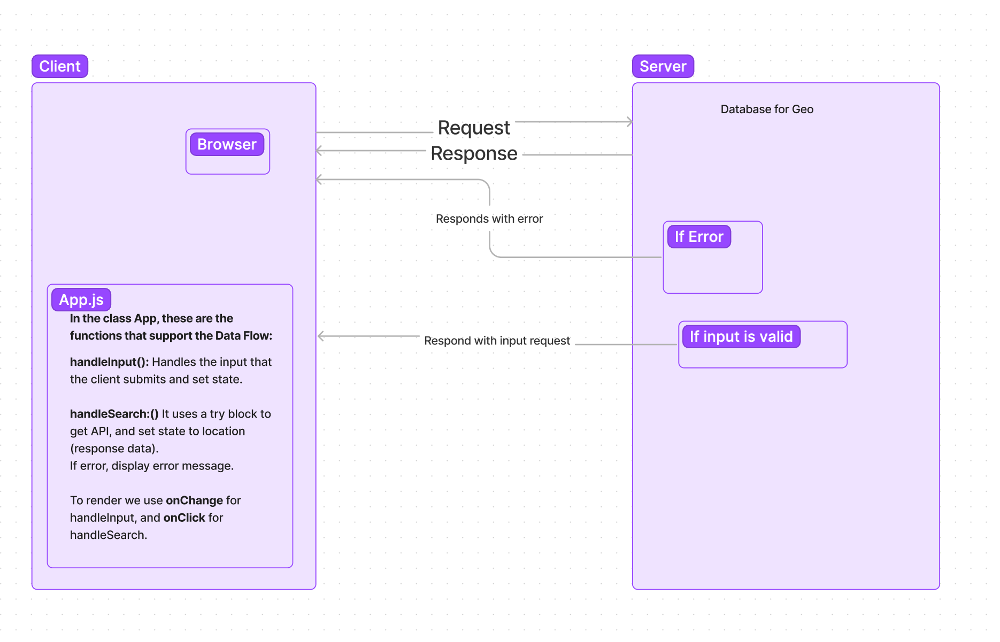
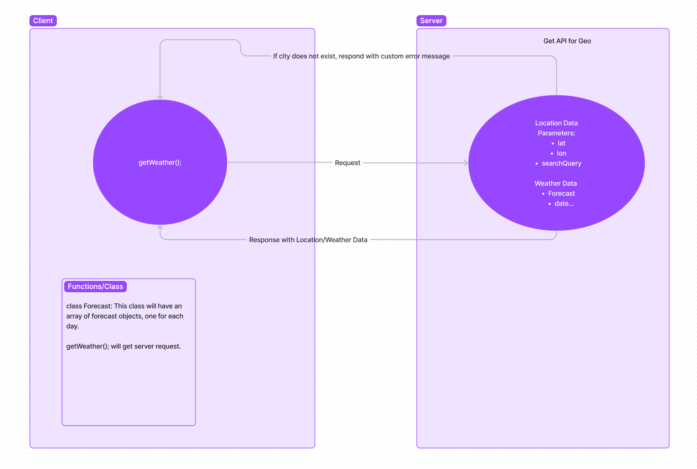
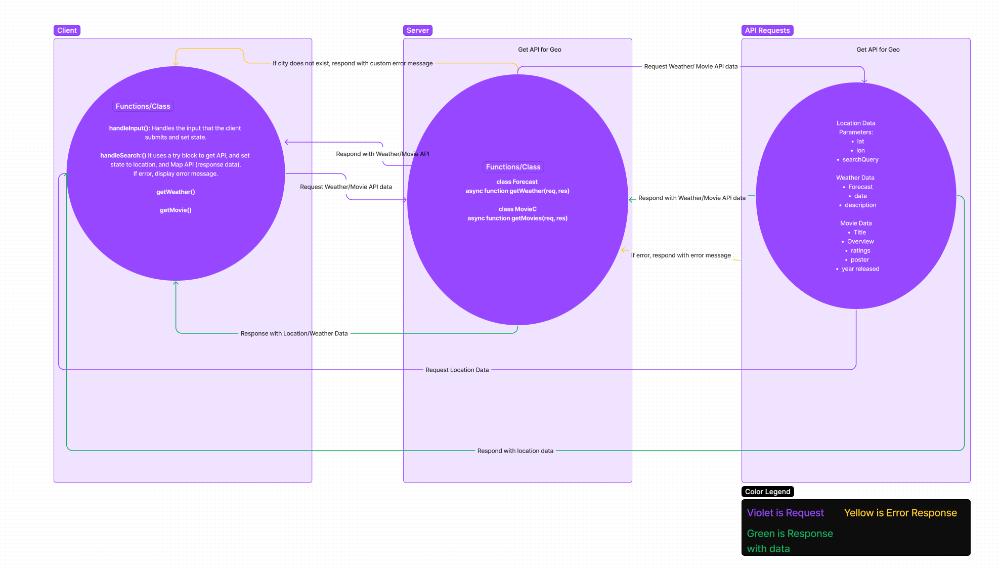

# City Explorer Api

**Author**: Maximo Vincente Mejia
**Version**: 1.0.3

## Overview

An application that can give us different type of information to any city in the world, with a single search.

## Getting Started - Data Flow for City Explorer Web Request-Response Cycle

## WRRC Outline of Functions

- For the web request-responce cycle, the client(browser), requests the Get API for geo location. If the response is invalid(false), a error message will display, which is handled by the handleSearch method. If the request is valid (true), the request of the location will be sent to the client, displaying the location and map, also handled by the handleSearch method.

- The handleInput method handles the input that the user submits, and set state.
- To render we onChange for handleInput, and onClick for handleSearch.

## Architecture

***JavaScript, React, Node.js, Geo-Location API, CSS, express.js***

## Change Log

09-27-2022 - Application can successfully render a City location with longitude, latitude, and map.
09-27-2022 - City Explorer now renders weather data for Seattle, Paris and Amman
09-28-2022 - City Explorer now renders weather, and movie data from an external API. Adding 16 day forecast, and information about movies of the city you searched

## Credit and Collaboration

[React Bootsrap Components](https://react-bootstrap.github.io/components/cards/)

## Time Estimate

- ***Name of Feature:*** Render Location, and Map of a searched city using API
- ***Estimate of time needed to complete:*** 3 hours
- ***Start Time:*** 6pm EST
- ***Finish Time:*** 12am EST
- ***Actual time needed:*** 6hrs

- ***Name of Feature:*** Use express as back end server to send data
- ***Estimate of time needed to complete:*** 2 hours
- ***Start Time:*** 5pm EST
- ***Finish Time:*** 6:17pm EST
- ***Actual time needed:*** 1hr 17min

- ***Name of Feature:*** Render Weather
- ***Estimate of time needed to complete:*** 2 hours
- ***Start Time:*** 7pm EST
- ***Finish Time:*** 8:38pm EST
- ***Actual time needed:*** 1hr 38min

- ***Name of Feature:*** Back-end and front-end Weather API
- ***Estimate of time needed to complete:*** 1.5 hours
- ***Start Time:*** 4:50pm EST
- ***Finish Time:*** 8:40pm EST
- ***Actual time needed:*** 4hr 10min

- ***Name of Feature:*** Back-end and front-end Weather API
- ***Estimate of time needed to complete:*** 1.5 hours
- ***Start Time:*** 9:00pm EST
- ***Finish Time:*** 9:56pm EST
- ***Actual time needed:*** 56 minutes

- ***Name of Feature:*** Modularize Back-end and Componetize front-end
- ***Estimate of time needed to complete:*** 2 hours
- ***Start Time:*** 6:27pm EST
- ***Finish Time:*** 7:14pm EST
- ***Actual time needed:*** 47 minutes
**I had already componetized my front end, so very little changes had to be made, and modularizing the back end was fairly simple**
